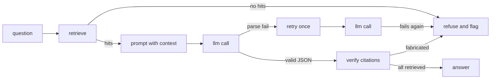

# The same work as a graph [[work-as-a-graph]]

## Draw it, or it does not exist

Three implementations, one paragraph of prose each, and nobody can tell them
apart. Draw them and the differences are the drawing.



That is `answer_question`, and every arrow is a decision somebody made. The
chain's drawing has three boxes in a row and no branches at all. Reflection adds
a `critique` box and one edge back — exactly one, and the cap is why it is one.

Two engineers whose drawings disagree about an edge have found a latent bug, and
they found it before it shipped. That is the cheapest bug report in this course.

## What a graph framework adds

Two scripts sit beside the notebook. Both run on the `fake` lane at zero cost,
and both print a reason and exit cleanly if langgraph is not installed.

```bash
uv add langgraph   # not a course dependency

uv run python units/en/unit2/session-08-loops-and-graphs/langgraph_capstone.py   # the loop, as a graph
uv run python units/en/unit2/session-08-loops-and-graphs/langgraph_subagents.py  # four narrow roles
```

`langgraph_capstone.py` builds the same assistant as a `StateGraph`: a declared
state, four nodes, and the revision policy as one routing function.

```python
def route(state: State) -> str:
    """The whole revision policy, as one declared edge. Cap: exactly one."""
    if state.get("revised"):
        return END
    return "revise" if not state.get("critique", "").upper().startswith("APPROVE") else END

builder.add_conditional_edges("critique", route, {"revise": "revise", END: END})
```

**What it buys.** The state is declared in one place, and so are the edges.
"What happens after a critique that does not approve" is a line you point at,
not a branch you go looking for. The script prints its node path, so the route a
run took is data rather than a story about it.

**What it costs.** A dependency, a second vocabulary, and a call count that
grows with every node you add. The graph as written answers, critiques and
revises — count its calls against the framework-free loop's one. The framework
did not make the work cheaper. It made the structure visible, and visible
structure is easy to add to.

## The sharper lesson is the subagents script

`langgraph_subagents.py` splits the work across four narrow roles: a router that
decides whether the corpus can support the question at all, a retriever, an
answerer, a critic. It runs two questions. The second one is about pizza, and
the corpus is about agents.

Read the second question's node path. The router should end that run after one
call, before retrieval. If it did not, the router is not doing its job — and a
role that does not do its job is a call you paid for and did not use.

That is the honest way to judge a split: not by how sophisticated it sounds, but
by whether each role's instruction is narrower than one combined prompt could
be. Four roles means at least three calls where the graded loop spends one. On a
small local model the extra hops are also where quality fails first — a critic
that cannot read carefully approves everything, which is worse than no critic,
because it looks like review.

## What `ch08-e2` asks for

Either you ran a script and can name the difference, or you did not and can say
why. Both are honest answers. A blank is not.

```python
graph_comparison = {
    "ran": True,
    "skipped_because": "",
    "framework_free_calls": 1,   # from the loop's trace
    "graph_calls": 3,            # printed by the script
    "difference": "...",         # what the traces showed, in one sentence
}
```

The check accepts `ran: False` with a real reason — no langgraph installed, no
provider, a model too small to critique anything. It refuses an empty string.
Recording "I did not run this and here is why" is a result; leaving it blank is
a gap that looks like a result.

## The graph you keep is not the framework

You do not need langgraph to have a graph. You need declared states and declared
edges, and those are a dict. The next page writes exactly that, in about ten
lines, and then makes it refuse the edges it never declared.

The habit generalises past workflows. Session 13 reads an API as a graph:
instruction X needs account A, A is derived from seed S, S comes out of
instruction Y. A flat list of endpoints hides those edges, and hiding them is
what makes an agent guess.
