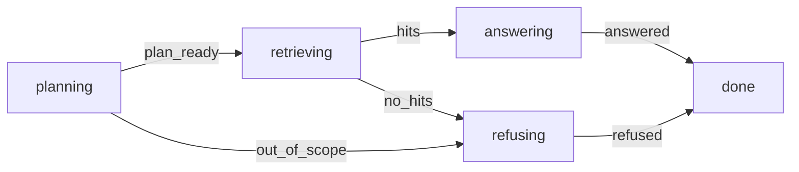

# Typed transitions, and the edge you refuse to follow [[typed-transitions]]

## Five states and six edges



```python
STATES = ("planning", "retrieving", "answering", "refusing", "done")

TRANSITIONS = {
    ("planning", "plan_ready"): "retrieving",
    ("planning", "out_of_scope"): "refusing",
    ("retrieving", "hits"): "answering",
    ("retrieving", "no_hits"): "refusing",
    ("answering", "answered"): "done",
    ("refusing", "refused"): "done",
}
```

The drawing and the dict say the same thing, and the dict is the one that runs.
Read two facts straight off it. There is no key whose value is `answering`
except from `retrieving`, so an answer can only follow a retrieval that found
something. And no key starts with `done`, which is the entire implementation of
"terminal".

## `step` is a lookup, and then a decision

```python
def step(state: dict, event: dict) -> dict:
    current, name = state["state"], event["name"]
    target = TRANSITIONS.get((current, name))
    if target is None:
        return {
            "state": current,
            "visited": list(state["visited"]),
            "rejected": f"{name!r} is not a declared event in state {current!r}",
        }
    return {"state": target, "visited": [*state["visited"], target], "rejected": None}
```

Ten lines, no model, no network, and the same verdict on every machine. The
state is a dict with three keys:

| Key | What it holds |
|---|---|
| `state` | one of the five names, never anything else |
| `visited` | the states entered, in order, starting at `planning` — it only grows |
| `rejected` | `None` after a legal move, a sentence after a refused one |

## Refuse, do not raise, and do not move

An illegal event has three possible answers and only one of them is any good.

| Response | What it does to the caller |
|---|---|
| Move anyway | the run continues in a state the design never allowed; the bug surfaces three steps later, somewhere else |
| Raise | every caller has to remember a `try`, and the one that forgets takes the process down over a routine event |
| **Refuse** | the state stays put, the reason is in the return value, and the run decides what to do next |

An out-of-order event is not an exception. It is an ordinary thing that happens
when a retry lands late, a queue delivers twice, or a tool answers after you
gave up on it. Ordinary things belong in the return value.

## The refusal is written for a reader

```python
rejected = f"{name!r} is not a declared event in state {current!r}"
```

Name the event and name the state it was refused from. "Invalid transition"
tells a colleague at 3am that something is wrong and nothing about what. The
same sentence with two names in it tells them which producer sent the wrong
event and where the run had actually got to.

`ch08-e3` looks for both names in the string for exactly that reason.

## `done` is terminal because nothing points out of it

There is no special case for `done`, no `if current == "done"`. It is terminal
because the table has no row starting there, so every event that arrives falls
into the same refusal branch as any other undeclared pair.

This matters more than it looks. A special case is code somebody can delete
during a refactor. A missing row is a fact about the data, and adding one is a
deliberate act you can see in a diff.

## `visited` only grows, and that is what pays for it

Append, never rebuild. A list that only grows is the run's history, and history
is what caps a loop.

```python
STORM = {**TRANSITIONS, ("retrieving", "retry"): "retrieving"}
```

One extra edge, perfectly legal, and the graph now has a run that never ends.
A retry storm is not a bug in the retry — it is an edge with nothing counting on
it. The count is already in your hand:

```python
MAX_VISITS = 3  # the first pass, plus two retries
if state["visited"].count("retrieving") >= MAX_VISITS:
    state = {**state, "rejected": f"'retrieving' entered {MAX_VISITS} times; retries spent"}
```

Same rule as session 5's budget, one level up: checked before the move, counted
in moves that happened, set by the application. A machine that rewrote `visited`
to `[current]` on every step could not express that cap at all. That is why the
check fails a `visited` that does not grow, even when every transition is right.

## A partial tool failure is a decision, not an accident

Two retrieval sources, one down, half the passages back. The graph will not let
you leave that ambiguous: something has to emit either `hits` or `no_hits`, and
that choice is yours to make in the open.

```python
found, failed = gather(QUESTION)
event = {"name": "hits" if found else "no_hits", "partial": bool(failed)}
```

The answer that follows is drafted from half a corpus. The flag has to travel
with it — this is what `needs_human_review` was built for in session 3 — and
`failed` names the source that went away, so the reader knows which half is
missing. What the state machine contributes is that the decision has a place to
live and a record it happened.

## What `ch08-e3` judges

| Scenario | What it drives | Fails when |
|---|---|---|
| the answer path | `plan_ready`, `hits`, `answered` | a move lands in the wrong state, or `visited` gains none or two entries |
| the out-of-scope path | `out_of_scope`, `refused` | the run passes through `answering`, or does not end `refusing` then `done` |
| the empty-retrieval path | `plan_ready`, `no_hits`, `refused` | same, from the other refusal edge |
| the terminal state | every event fired at `done` | anything moves, or moves quietly |
| every undeclared pair | all five states × every event | the state changes, `visited` changes, `step` raises, or the reason names neither the event nor the state |
| the same run twice | the answer path, again | the two runs differ, which means a counter or a global is deciding |

No model is involved in any of it. The check writes the event sequences itself,
so every edge is exercised on purpose rather than when a model happens to pick
it — the same trick as session 5's scripted plan.

## Recap

| Lesson | One line |
|---|---|
| The ladder | climb a rung only when a measured failure justifies it |
| The table | two columns are counted facts; only the failure modes are judgement |
| The graph | declared states and declared edges, which a dict already is |
| Refusal | an illegal event does not move you, does not raise, and says why |
| Terminal | `done` has no outgoing row, so no special case can be deleted by accident |
| `visited` | the history only grows, and a cap is a rule about the history |
